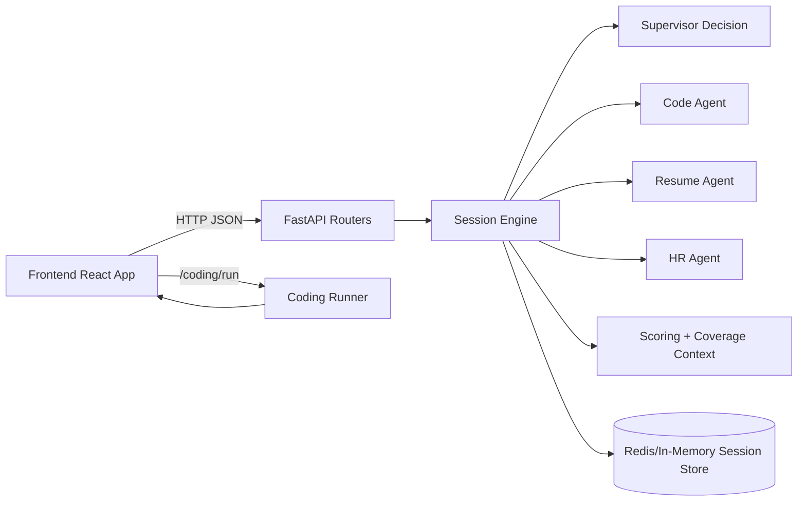
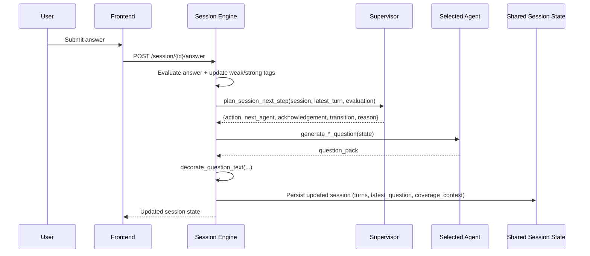
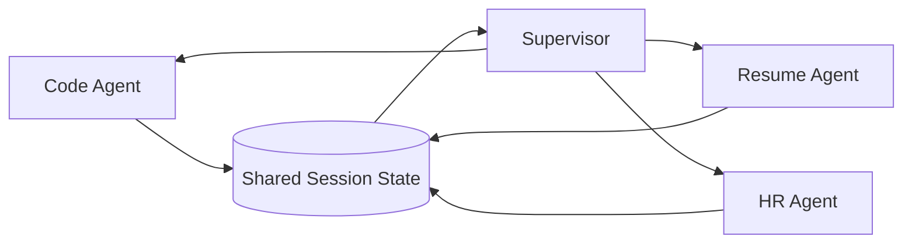
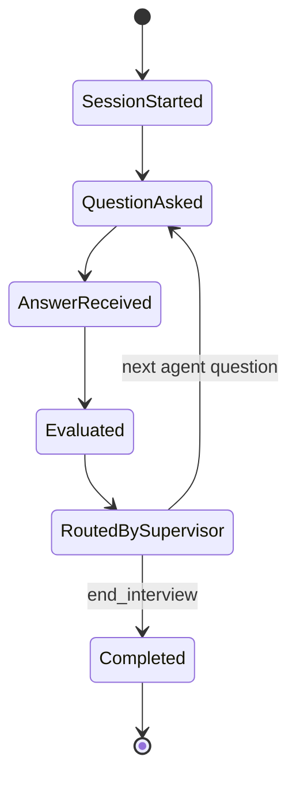

# Mock Interview AI Platform

End-to-end mock interview system with:
- **React + Chakra UI frontend**
- **FastAPI backend**
- **Agentic multi-round interview orchestration** (Code / Resume / HR)
- **Resume ingestion + parsing**
- **Coding runner with test-case evaluation**
- **Session scoring + interview report generation**

---

## 1) Product Overview

This platform simulates a realistic interviewer that:
1. Starts an interview session from selected rounds/topics/company/role.
2. Curates next questions dynamically using a supervisor + specialist agents.
3. Captures candidate responses (voice transcript + typed/coding answers).
4. Evaluates each turn and updates strengths/weaknesses continuously.
5. Produces domain scores and an overall recommendation at the end.

The current architecture is optimized for rapid iteration and local development, with optional Redis persistence and LLM-backed generation.  

---

## 2) Repository Structure

```text
mock-interview-backend/
  agents/                   # Specialist + supervisor agent logic and prompts
  models/                   # Pydantic request/response models
  routers/                  # FastAPI route modules
  services/session_engine.py# Core orchestration and scoring pipeline
  main.py                   # FastAPI app bootstrap

mock-interview-frontend/
  src/pages/InterviewPage.jsx
  src/components/CodingPlayground.jsx
  src/api/*.js              # API client wrappers
```

---

## 3) Architecture (Client ↔ Backend ↔ Agentic Pipeline)



### 3.1 AI system design (high-level components)

```mermaid
flowchart TB
  subgraph FE[Frontend]
    FE1[Interview Setup]
    FE2[Interview Page]
    FE3[Coding Playground]
  end

  subgraph API[FastAPI Layer]
    R1[/session/*]
    R2[/coding/run]
    R3[/auth/google]
  end

  subgraph ORCH[Orchestration]
    SE[Session Engine]
    SUP[Supervisor Node]
    CA[Code Agent]
    RA[Resume Agent]
    HA[HR Agent]
    EVAL[Scoring + Coverage Updater]
  end

  subgraph MEM[Shared Memory / State]
    SM[(Session Object)]
    RS[(Redis or In-Memory Store)]
  end

  FE --> API
  R1 --> SE
  R2 --> SE
  SE --> SUP
  SUP --> CA
  SUP --> RA
  SUP --> HA
  CA --> EVAL
  RA --> EVAL
  HA --> EVAL
  EVAL --> SM
  SE --> SM
  SM --> RS
  RS --> SE
```

### Runtime orchestration summary
- Frontend calls `/session/start`.
- Session engine creates `turn_plan`, generates first question, returns `latest_question`.
- Frontend renders question + live transcript.
- Candidate submits answer via `/session/{id}/answer`.
- Session engine evaluates, asks supervisor for routing decision, generates next question, and updates scores.

---

## 4) Agentic Model Design

### 4.1 Specialist agents
- **Code agent**: technical DSA/system-design prompts and follow-ups.
- **Resume agent**: STAR-style probing using resume summary/topics.
- **HR agent**: behavioral/collaboration evaluation.

### 4.2 Supervisor logic
- Decides whether to:
  - continue in same round,
  - ask follow-up,
  - switch to another round,
  - end interview.
- Uses:
  - current turn quality,
  - candidate “stuck” signals,
  - selected round order/topics,
  - turn limits.

### 4.2.1 What the supervisor generates first and every turn

The supervisor does **not** directly ask the core technical/resume/hr question.  
Instead, it generates a **routing + framing decision JSON**:

- `action`: `ask_question | follow_up | switch_round | end_interview`
- `next_agent`: `code | resume | hr`
- `focus`: routing intent
- `acknowledgement`: short natural acknowledgement for candidate answer
- `transition`: bridge text to next question
- `reason`: trace/debug rationale

This decision is then used by the session engine to:
1. pick the next specialist agent,
2. request the specialist-generated question pack,
3. decorate the question with supervisor acknowledgement/transition,
4. persist it as `latest_question`.

### 4.2.2 Supervisor decision sequence (per answer)



### 4.3 “Multi-model” behavior
- The system is **multi-agent** by default (supervisor + 3 specialists).
- Model provider integration is through shared `build_llm()` abstraction, so you can swap to other providers/models without changing orchestration surface.
- Fallback logic keeps interview flow operational when LLM is unavailable.

### 4.4 Three-agent communication model

Agents do not call each other directly.  
Communication happens through **shared state + supervisor routing**:

1. Each specialist agent reads the current state snapshot (coverage, role, company, topics, etc.).
2. Agent returns a `question_pack`.
3. Session engine evaluates candidate response and writes results into shared coverage context.
4. Supervisor reads updated shared context and decides the next agent.
5. Next agent receives the new shared context and continues.

This is effectively a mediated communication loop:



---

## 5) Interview Curation + Evaluation Flow

### Curation inputs
- company, role, experience
- selected interview types
- topic preferences
- difficulty
- job description
- resume content (text / url / base64 pdf)

### Curation logic
- Build round sequence from selected types and/or distributions.
- Normalize topics and deduplicate.
- Merge inferred resume topics into `resume-based` round.
- Generate first question pack from active specialist.

### Evaluation logic
- Dimension-based scoring per round (rubric-based).
- Weak/strong tags captured in coverage context.
- Final scores aggregate by domain + overall average.

---

## 6) Coding Experience (LeetCode-style)

When current question is coding:
- Coding panel auto-opens.
- Candidate sees:
  - problem statement,
  - approach hints,
  - examples + explanation,
  - test cases list,
  - solve-function contract.
- Candidate can:
  - choose Python/JavaScript,
  - run tests (`/coding/run`),
  - submit solution to interview session (`/session/{id}/answer` with code payload).

### Solve function contract
- Python: `solve(input_data)`
- JavaScript: `solve(inputData)`
- Must **return** the final output directly.

---

## 7) Resume Ingestion + Topic Extraction

Resume supports:
- `format=text`
- `format=url`
- `format=pdf_base64`

Pipeline:
1. Extract text.
2. Basic parse (skills, etc.).
3. Optional LLM structured enrichment (topics, summary, projects, strengths).
4. Merge enriched topics into interview topic map.
5. Feed resume summary into resume question generation.

---

## 8) API Reference (End-to-End)

## Root
- `GET /` → health message.

## Companies
- `GET /companies/top` → top tech companies.

## Auth
- `POST /auth/google` → creates/returns user profile using Firebase-authenticated context.

## Session (primary interview engine)
- `POST /session/start`
- `POST /session/{session_id}/answer`
- `GET /session/{session_id}/state`
- `POST /session/{session_id}/end`
- `GET /session/{session_id}/report`
- `GET /session/{session_id}/logs`

## Coding runner
- `POST /coding/run`
  - payload: `{ code, language, test_cases[] }`
  - response: `{ total, passed, all_passed, results[] }`

## Legacy interview routes (demo CRUD)
- `/interview/create`
- `/interview/{id}`
- `/interview/{id}/reply`
- `/interview/{id}/complete`

---

## 9) Data & Persistence Model

### Session storage
- Uses Redis when configured (`REDIS_URL`), otherwise in-memory dictionary.
- TTL controlled by `SESSION_TTL_SECONDS`.

### Session object includes
- candidate metadata + parsed resume
- interview config and turn plan
- active question and pending turn id
- full turn history
- coverage context
- final score card

### 9.1 Shared memory / shared state schema (conceptual)

`session` acts as the shared memory bus for all agents and includes:
- identity: `session_id`, `created_at`, `status`
- candidate: profile + parsed/enriched resume
- interview config: rounds, topics, difficulty, company/role/JD context
- dynamic cursor:
  - `turn_counter`
  - `current_agent`
  - `current_round_type`
  - `current_turn_spec`
  - `pending_turn_id`
- question stream:
  - `latest_question`
  - `turns[]` (question, answer, evaluation)
- coverage memory:
  - `already_asked_topics`
  - `weakness_tags`
  - `strength_tags`
  - `avoid_topics`
- governance/debug:
  - `locked`
  - `request_cache` (idempotency)
  - `debug_trace`

Because each turn rewrites this shared session object, every agent uses consistent context without direct peer messaging.

### 9.2 How memory evolves over turns



### External databases
- Firebase Firestore is used for user profile persistence in auth flow.

---

## 10) Frontend ↔ Backend Communication

### Client flow
1. Setup page collects config.
2. Frontend calls `/session/start`.
3. Interview page renders `latest_question`.
4. Candidate submits text/voice or code outcome.
5. Frontend polls/refreshes session state and eventually fetches report.

### 10.1 How next questions are produced

1. Frontend submits current turn answer.
2. Backend evaluates answer against rubric dimensions.
3. Coverage memory is updated (weak/strong tags, topic history).
4. Supervisor chooses follow-up/switch/end + next specialist.
5. Specialist generates next question pack.
6. Session engine decorates with conversational transition.
7. Updated session is returned; frontend renders new question immediately.

### Payload highlights
- Text answer submission supports optional:
  - `code_submitted`
  - `language`
  - request id for idempotency.

---

## 11) Environment & Setup

### Backend
```bash
cd mock-interview-backend
pip install -r requirements.txt
uvicorn main:app --reload --port 8000
```

### Frontend
```bash
cd mock-interview-frontend
npm install
npm run dev
```

### Optional env vars
- `GROQ_API_KEY` (LLM generation)
- `REDIS_URL` (session persistence)
- `SESSION_TTL_SECONDS` (cache TTL)

---

## 12) Screenshots

> The environment used for this update did not provide browser screenshot tooling.
> Add real screenshots at these paths when running locally:

- `docs/screenshots/setup-page.png`
- `docs/screenshots/interview-live-panel.png`
- `docs/screenshots/coding-playground-problem.png`
- `docs/screenshots/coding-test-results.png`
- `docs/screenshots/result-report.png`

Markdown references (ready to use):

```md


```

---

## 13) User Guidelines

### Candidate
1. Choose company/role/experience.
2. Select interview rounds and topics.
3. Upload/paste resume if using resume-based rounds.
4. For coding rounds, implement `solve(...)`, run tests, then submit.
5. Complete session and review detailed report.

### Interview designer / recruiter
1. Define topic distributions and selected rounds.
2. Use logs endpoint to inspect routing/debug trace.
3. Evaluate score breakdown and weak/strong indicators.

---

## 14) Developer Notes

- Keep prompt contracts strict JSON.
- Ensure coding test cases are always present for coding rounds.
- Maintain idempotent answer submissions using request ids.
- Add automated tests for:
  - coding runner harnesses,
  - session turn transitions,
  - scoring stability.
